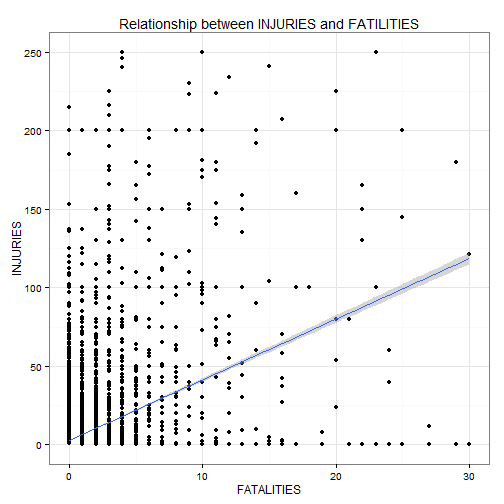
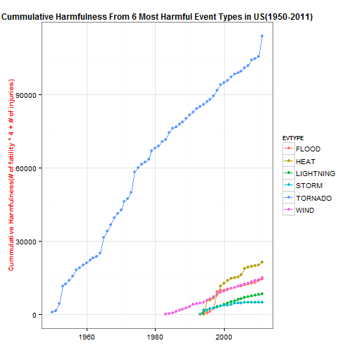
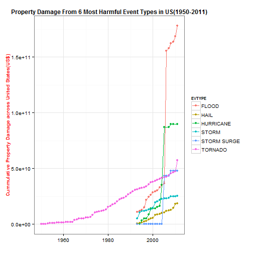

# Major Storms and Weather Events in US

Storms and other severe weather events can cause both public health and economic problems for communities and municipalities. Many severe events can result in fatalities, injuries, and property damage, and preventing such outcomes to the extent possible is a key concern. This project involves exploring the U.S. National Oceanic and Atmospheric Administration's (NOAA) storm database. The major goal of this analysis is answer the following two questions.First, Across the United States, which types of events are most harmful with respect to population health? Second, Across the United States, which types of events have the greatest economic consequences? This analysis is done all the way from downloading raw dataset to plot the processed data, which makes it possible fully reproducible by other people. As raw dataset is quite messy, I will clean the data during the process, and also determine a new strategy how to interpret the data. In the end, by showing both table and plot, I will answer both questions.


## 1. Data Processing
Data Processing step begins with making a new directory and downloading raw data file into that directory to make this whole analysis to be completely reproducible for everyone.

NOTE : To save the time to load data, I first check the names of features with readLines function(which I omit at this script), and then extract only the features that I want to keep in the dataset. This allows me to save tremendous time, and it will be helpful for those who try to reproduce this step. The idea to extract only the features that I need is from [Discussion Forum](https://class.coursera.org/repdata-004/forum/thread?thread_id=140).


```r
if(!file.exists("./reproducible2")) {
        dir.create("./reproducible2")
        fileUrl <- "https://d396qusza40orc.cloudfront.net/repdata%2Fdata%2FStormData.csv.bz2"
        download.file(fileUrl, destfile = "./reproducible2/dataset.csv.bz2")
}
setwd("./reproducible2")
Sys.setlocale('LC_ALL', 'C')
```

```
## [1] "C"
```

```r
library(knitr)
library(markdown)
library(plyr)
library(ggplot2)
library(scales)

subcolumn = c("NULL", "character", rep("NULL", 4), "character", "character", rep("NULL", 14),
        "numeric", "numeric", "numeric", "character", "numeric", "character", rep("NULL", 9))
dataset <- read.csv("dataset.csv.bz2", colClasses= subcolumn)
```

## 2. Pre-Cleaning Process

### 2-1) Change column classes
1. Extract only "YEAR" from the original date format and change the column name to "YEAR".
2. Change character format columns into factor format.

### 2-2) Remove zero value objects 
As a first data clean process I will remove rows which have zero values for fatalities, injuries and two property damages at the same time, simply because this implies corresponding events were not harmful to the community. To subtract those rows I used 'setdiff()' function. Now we can reduce the size of dataset almost 3/4, which is awesome!

```r
dataset$BGN_DATE <- as.factor(strftime(strptime(dataset$BGN_DATE, "%m/%e/%Y %H:%M:%S"),"%Y"))
names(dataset)[1] <- "YEAR"

for (i in c(2,3,7,9)){
        dataset[,i] <- as.factor(dataset[,i])
}

zerodataset <- subset(dataset, FATALITIES==0 & INJURIES==0 & PROPDMG==0 & CROPDMG==0)
dataset <- dataset[setdiff(rownames(dataset),rownames(zerodataset)),]
```


### NOTE : About cleaning event type name
As we have 985 different types of event, it will be inefficient to check through and clean all the event names at this point. What we are interested in with this dataset is not about all types of event, but about most harmful event types. So, I will just keep all the event type names uncleaned until I will narrow them down to less than 10 most influential(harmful) types for both questions(one for population health and the other for property damage), and I will clean the data when needed.


# Question #1
Across the United States, which types of events (as indicated in the EVTYPE variable) are most harmful with respect to population health?

## 1. Cleaning Data Process for Question #1
1. Extract only the features that we need to solve Question #1

2. As a further data cleaning process for Q1, I will similary remove rows which have zero values for 'FATILITIES', 'INJURIES' at the same time, simply because that implies corresponding events were not harmful to the community. Here I also used 'setdiff()' function. By doing so we can reduce tremendous size of dataset. 254633 - 232704 = 21929. Almost 9/10, Fantastic!


```r
dataset1 <- dataset[,c(1,2,3,4,5)]

zerodataset1 <- subset(dataset1, FATALITIES==0 & INJURIES==0)
dataset1 <- dataset1[setdiff(rownames(dataset1),rownames(zerodataset1)),]
```

## 2. How to define harmfulness of event to the population health?

As we have a limited direction about applying our features to measure the harmfulness of event to the population health, I will set my own strategy here. To do that, let's first take a look at those two variables(fatalities and injuries), and see whether there is some meaningful realtionship between them. One good way to see the relationship is check the correlation coefficient value between fatalities and injuries.


```r
cor(dataset1$INJURIES, dataset1$FATALITIES)
```

```
## [1] 0.3044
```

### 2-1) '0.3044'. A weak uphill (positive) linear relationship.

For those who doesn't know much about correlation coefficient, please check the following website : [How to Interpret a Correlation Coefficient r?](http://www.dummies.com/how-to/content/how-to-interpret-a-correlation-coefficient-r.html)

Even if it is a waek, still there is a positive linear realationship between two variables. To see more clearly how two values are related to each other, I will draw a simple plot between fatalities and injuries, and draw a linear regression line.

Note: I will give axis limitations for both fatalities and injuries to exclude outliers. Having tried many times to adjust the limitation range, I found it reasonable to put (0,30) for FATALITIES and (0,250) for INJURIES with 72 plots removed. Of course you can try adjusting yourself simply by changing the numbers. 


### 2-2) Draw Plot between injuries and fatalities

```r
cor = ggplot(dataset1, aes(x=FATALITIES, y=INJURIES))
cor = cor + geom_point(stat="identity")
cor = cor + xlim(0,30) + ylim(0,250)
cor = cor + theme_bw()
cor = cor + geom_smooth(method = "lm")
cor = cor + labs(title = "Relationship between INJURIES and FATILITIES")
print(cor)
```

```
## Warning: Removed 72 rows containing missing values (stat_smooth).
## Warning: Removed 72 rows containing missing values (geom_point).
```

 

According to the linear regression line on the graph, the slop of the line 'a'(y=ax) is approximately '4', which means on average when 4 people are injured by certain event 1 person is dead. So I would say that it is quite reasonable to multiply 4 to every fatility number before we sum it up with injuries. Now here is my strategy.

```r
dataset1$harmful <- 4*(dataset1$FATALITIES) + dataset1$INJURIES
```


## 3. Calculate most harmful event types

### 3-1) MEAN value Vs. Sum value
Now we have set the strategy how to calculate the harmfulness of event. But there remains still one other issue, which is how to interpret the question. Let me remind you what the exact qustion was. Here is the question : **Across the United States, which types of events (as indicated in the EVTYPE variable) are most harmful with respect to population health?** 

you could argue that as the frequency of occurrence of each event is different we need to calculate the mean value of each event so that we can compare which types of events are most harmful. Then you will get the following result. This is 10 most harmful events with the event type names uncleand.

```r
harmmean <- ddply(dataset1, .(EVTYPE), summarize, meanharmful = mean(harmful, na.rm=T))
harmmean <- harmmean[with(harmmean, order(-meanharmful)),]
head(harmmean,10)
```

```
##                         EVTYPE meanharmful
## 206                 WILD FIRES      162.00
## 194                    TSUNAMI      130.50
## 199  UNSEASONABLY WARM AND DRY      116.00
## 186 TORNADOES, TSTM WIND, HAIL      100.00
## 188      TROPICAL STORM GORDON       75.00
## 106                  Heat Wave       70.00
## 145      RECORD/EXCESSIVE HEAT       68.00
## 102          HURRICANE/TYPHOON       58.88
## 214              WINTER STORMS       57.00
## 13               COLD AND SNOW       56.00
```

However, I have different opinion. My interpretation about question #1 is not about how harmful the event is when it occurs once, which means we don't need to compensate the frequency of occurrence. If it happens often, then it is much more harmful to the community. So I argue that we have to calculate the sum value instead of mean value.


### 3-2) Extract Top 30 harmful Event Types by Sum Values
1. **Note.1** : As mentioned at the beggining, we are more interested in the most harmful events than every single event. That's why I first extract only top 30 most harmful values, and then I will clean the event type names. Then I will extract 6 most harmful event types.The number 30 seemed to be reasonable for me to pick. The other values over 30 seems to be too small to influence the result. But, of course we could try with another numbers.

2. **NOTE.2** : I will use 'harmsum' data frame to show you the table format to answer the question #1. But I am also planning to plot these 6 most harmful event types with its cumulative harmfulness by year from 1950 to 2011 so that you can see since when the data of each event has been collected, and how dramatically the harmfulness has been increased. By doing so you can still compare the harmfulness among events even if the data of all the events haven't been collected.   

3. Here is my way to do that. First we extract only dataset from "dataset1" whose event type(EVTYPE) match with the 30 most harmful event type(list in the 'harmsum dataset'). Then I will also clean the event type names, and again extract 6 most harmful event types by using 'harmsumTOP6' dataset. Then I will calculate sum value of each EVTYPE by year, and finally calculate cumulative harmfulness year by year to plot this data.

4. The process for both 'harmsum' and 'dataset1' are very similar, so I group them together as they are processed one step further. 


```r
harmsum <- ddply(dataset1, .(EVTYPE), summarize, totalharmful = sum(harmful, na.rm=T))
harmsum <- harmsum[with(harmsum, order(-totalharmful)),]
harmsum <- head(harmsum, 30)
harmsumOrigin <- harmsum

dataset1 <- subset(dataset1, EVTYPE %in% harmsum$EVTYPE)
dataset1$EVTYPE <- factor(dataset1$EVTYPE)
```

### 3-3) Clean Event Type Names
Here I attached a merged data frame to show how I cleaned EVTYPE names.

```r
harmsum$EVTYPE <- as.character(harmsum$EVTYPE)
harmsum[grep("WIND", harmsum$EVTYPE),]["EVTYPE"] <- "WIND"
harmsum[grep("FLOOD", harmsum$EVTYPE),]["EVTYPE"] <- "FLOOD"
harmsum[grep("HEAT", harmsum$EVTYPE),]["EVTYPE"] <- "HEAT"
harmsum[grep("STORM", harmsum$EVTYPE),]["EVTYPE"] <- "STORM"

mergedharm <- merge(harmsumOrigin, harmsum, by="totalharmful")
names(mergedharm) <- c("totalhamful", "OriginalEVTYPE", "CleanedEVTYPE")
mergedharm
```

```
##    totalhamful     OriginalEVTYPE     CleanedEVTYPE
## 1          530     WINTER WEATHER    WINTER WEATHER
## 2          539       EXTREME HEAT              HEAT
## 3          556          HIGH SURF         HIGH SURF
## 4          572     TROPICAL STORM             STORM
## 5          593   WILD/FOREST FIRE  WILD/FOREST FIRE
## 6          643         HEAVY RAIN        HEAVY RAIN
## 7          692        STRONG WIND              WIND
## 8          871       EXTREME COLD      EXTREME COLD
## 9          982                FOG               FOG
## 10         997          HEAT WAVE              HEAT
## 11        1066          AVALANCHE         AVALANCHE
## 12        1113       RIP CURRENTS      RIP CURRENTS
## 13        1164 THUNDERSTORM WINDS              WIND
## 14        1209           BLIZZARD          BLIZZARD
## 15        1211           WILDFIRE          WILDFIRE
## 16        1421               HAIL              HAIL
## 17        1529         HEAVY SNOW        HEAVY SNOW
## 18        1531  HURRICANE/TYPHOON HURRICANE/TYPHOON
## 19        1704        RIP CURRENT       RIP CURRENT
## 20        2020  THUNDERSTORM WIND              WIND
## 21        2129          HIGH WIND              WIND
## 22        2145       WINTER STORM             STORM
## 23        2331          ICE STORM             STORM
## 24        5689        FLASH FLOOD             FLOOD
## 25        5848               HEAT              HEAT
## 26        8494          LIGHTNING         LIGHTNING
## 27        8669              FLOOD             FLOOD
## 28        8973          TSTM WIND              WIND
## 29       14137     EXCESSIVE HEAT              HEAT
## 30      113878            TORNADO           TORNADO
```

```r
harmsum$EVTYPE <- factor(harmsum$EVTYPE)

dataset1$EVTYPE <- as.character(dataset1$EVTYPE)
dataset1[grep("WIND", dataset1$EVTYPE),]["EVTYPE"] <- "WIND"
dataset1[grep("FLOOD", dataset1$EVTYPE),]["EVTYPE"] <- "FLOOD"
dataset1[grep("HEAT", dataset1$EVTYPE),]["EVTYPE"] <- "HEAT"
dataset1[grep("STORM", dataset1$EVTYPE),]["EVTYPE"] <- "STORM"
dataset1$EVTYPE <- factor(dataset1$EVTYPE)
```


### 3-4) Select 6 Most Harmful Event Types
After checking top 20 most harmful event types I will select only top 6 of them because the gap between 6th and 7th event types is huge.

```r
harmsumTOP6 <- ddply(harmsum, .(EVTYPE), summarize, totalharmful = sum(totalharmful, na.rm=T))
harmsumTOP6 <- harmsumTOP6[with(harmsumTOP6, order(-totalharmful)),]
harmsumTOP6 <- head(harmsumTOP6, 6)
harmsumTOP6
```

```
##       EVTYPE totalharmful
## 16   TORNADO       113878
## 7       HEAT        21521
## 19      WIND        14978
## 4      FLOOD        14358
## 12 LIGHTNING         8494
## 15     STORM         5048
```

```r
dataset1 <- subset(dataset1, EVTYPE %in% harmsumTOP6$EVTYPE)
dataset1$EVTYPE <- factor(dataset1$EVTYPE)

totalharmful <- ddply(dataset1, .(YEAR, EVTYPE), summarize, totharmful = sum(harmful, na.rm=T))
cumtotharmful <- ddply(totalharmful, .(EVTYPE), transform, harmfulcumsum = cumsum(totharmful))
```


## 4. Results for Question #1

```r
harm = ggplot(cumtotharmful, aes(x=as.numeric(as.character(YEAR)), y=harmfulcumsum, color=EVTYPE))
harm = harm + geom_point()
harm = harm + geom_line()
harm = harm + theme_bw()
harm = harm + labs(y= "Cummulative Harmfulness(# of fatility * 4 + # of injuries)")
harm = harm + labs(x= "")
harm = harm + labs(title = "Cummulative Harmfulness From 6 Most Harmful Event Types in US(1950-2011)")
harm = harm + theme(axis.title=element_text(size=10, color="red"))
harm = harm + theme(axis.text=element_text(size=10))
harm = harm + theme(title=element_text(size=10,face="bold"))
print(harm)
```

 

```r
harmsumTOP6
```

```
##       EVTYPE totalharmful
## 16   TORNADO       113878
## 7       HEAT        21521
## 19      WIND        14978
## 4      FLOOD        14358
## 12 LIGHTNING         8494
## 15     STORM         5048
```

From the table(harmsumTOP6) and plot(harm) we can answer to the question #1(**Across the United States, which types of events (as indicated in the EVTYPE variable) are most harmful with respect to population health?**)

Over the whole period from 1950 to 2011, we can see clearly that TORNADO has been the most harmful event type with respect to population health. Even if the data for the other 5 event types started to be collected way later than TORNADO, we can still say that TORNADO is way harmful by looking at the slope of the graph. HEAT, WIND, FLOOD, LIGHTING, and STORM are the next 5 most harmful event types with respect to population health.


# Question #2
Across the United States, which types of events have the greatest economic consequences?

## 1. Cleaning Data Process for Question #2
1. Extract only the features that we need to solve Question #2

2. As a second data clean process for Question2, I will similary remove rows which have zero values for PROPDMG, CROPDMG at the same time, simply because that implies corresponding events were not harmful to the community. Here I also used 'setdiff()' function. Now we reduced size of dataset a little bit. 254633 - 9602 = 245031!


```r
dataset2 <- dataset[,c(1,2,3,6,7,8,9)]

zerodataset2 <- subset(dataset2, PROPDMG==0 & CROPDMG==0)
dataset2 <- dataset2[setdiff(rownames(dataset2),rownames(zerodataset2)),]
```


### 1-1) Clean data with PROPDMGEXP

First of all, the levels with non-zero PROPDMGEXP values from the summary above are not explicitly explained except "B", "K", "M" values, and second of all, the portion of unexplained levels(i.e. "+", "-", "0~8", "H", "h", "m", and also NA values) are less than 2% of the total number, and I consider them reasonably negligible.

As I am planning to translate "B", "K", "M" to numerical units, and then multiply those PROPDMGEXP units with PROPDMG values to calculate "real property damage values" in the following steps, at this point I will simply put zero values into those unexplained and missing values so that corresponding real property damage values become zero in the end.

```r
summary(dataset2$PROPDMGEXP)
```

```
##             +      -      0      1      2      3      4      5      6 
##   4357      5      1    209      0      1      1      4     18      3 
##      7      8      ?      B      H      K      M      h      m 
##      2      0      0     40      6 229057  11319      1      7
```

```r
knownDMGPEXP = c("B", "M", "K")

dataset2[with(dataset2, !(PROPDMGEXP %in% knownDMGPEXP)),]["PROPDMGEXP"] <- 0
dataset2$PROPDMGEXP <- factor(dataset2$PROPDMGEXP)
```

### 1-2) Clean data with CROPDMGEXP

Similarly, for CROPDMGEXP values, we also have some unexplained values(i.e. "0", "?", "k", "m"), and the sum of the number of objects from these values are less than 50 which is also negligible. However here we have 145037 NA values. But out of 145037 objects only 3 of them have non-zero CROPDMG value, which means these huge number of NA values are also negligible.

```r
summary(dataset2$CROPDMGEXP)
```

```
##             0      2      ?      B      K      M      k      m 
## 145037     17      0      6      7  97960   1982     21      1
```

```r
subset(dataset2, CROPDMGEXP=="")[subset(dataset2, CROPDMGEXP=="")["CROPDMG"] != 0,]
```

```
##        YEAR STATE             EVTYPE PROPDMG PROPDMGEXP CROPDMG CROPDMGEXP
## 221857 1994    ND               HAIL       5          K       3           
## 238757 1994    TX THUNDERSTORM WINDS       5          M       4           
## 240397 1994    TX THUNDERSTORM WINDS     500          K       4
```

```r
dataset2[with(dataset2, !(CROPDMGEXP %in% knownDMGPEXP)),]["CROPDMGEXP"] <- 0
dataset2$CROPDMGEXP <- factor(dataset2$CROPDMGEXP)
```

## 3. Calculate most harmful event types for economy

### 3-1) Calculate Real Damage Value

Translate both PROPDMGEXP and CROPDMGEXP units into real numbers and put those numbers in new columns(PROPDMGEXPval, CROPDMGEXPval respectively). And then, calculate real damage values by multiplying with PROPDMG and CROPDMG respectively, followed by sum them up for each object.

After calculate the real damage value, we extract only those features we need to draw a plot(i.e. YEAR, EVTYPE, realDMG)


```r
dataset2$PROPDMGEXPval <- rep(0, nrow(dataset2))
dataset2[dataset2$PROPDMGEXP=="K",]["PROPDMGEXPval"] <- 1000 
dataset2[dataset2$PROPDMGEXP=="M",]["PROPDMGEXPval"] <- 1000000 
dataset2[dataset2$PROPDMGEXP=="B",]["PROPDMGEXPval"] <- 1000000000

dataset2$CROPDMGEXPval <- rep(0, nrow(dataset2))
dataset2[dataset2$CROPDMGEXP=="K",]["CROPDMGEXPval"] <- 1000 
dataset2[dataset2$CROPDMGEXP=="M",]["CROPDMGEXPval"] <- 1000000 
dataset2[dataset2$CROPDMGEXP=="B",]["CROPDMGEXPval"] <- 1000000000

dataset2$PROPrealDMG <- with(dataset2, PROPDMG * PROPDMGEXPval)
dataset2$CROPrealDMG <- with(dataset2, CROPDMG * CROPDMGEXPval)
dataset2$realDMG <- with(dataset2, PROPrealDMG+CROPrealDMG)

dataset2 <- dataset2[,c(1,3,12)]
```


### 3-2) Extract Top 30 harmful Event Types by Sum Values

1. **Note.1** : Similar to the process for question number 1, I first extract only top 30 most harmful values, and then I will clean the event type names. Then I will extract 6 most harmful event types. Plotting process is also same as that of question number 1.

```r
DMGsum <- ddply(dataset2, .(EVTYPE), summarize, totalrealDMG = sum(realDMG, na.rm=T))
DMGsum <- DMGsum[with(DMGsum, order(-totalrealDMG)),]
DMGsum <- head(DMGsum, 30)
DMGsumOrigin <- DMGsum

dataset2 <- subset(dataset2, EVTYPE %in% DMGsum$EVTYPE)
dataset2$EVTYPE <- factor(dataset2$EVTYPE)
```

### 3-3) Clean event type names
I cleaned data except event types which consist of multiple types such as 'TORNADOES, TSTM WIND, HAIL'. Here I also attached a merged data frame to show how I cleaned EVTYPE names.

```r
DMGsum$EVTYPE <- as.character(DMGsum$EVTYPE)
DMGsum[grep("WIND", DMGsum$EVTYPE),][-5,]["EVTYPE"]<- "WIND"
DMGsum[grep("FLOOD", DMGsum$EVTYPE),]["EVTYPE"] <- "FLOOD"
DMGsum[grep("FIRE", DMGsum$EVTYPE),]["EVTYPE"] <- "FIRE"
DMGsum[grep("SURGE", DMGsum$EVTYPE),]["EVTYPE"] <- "STORM SURGE"
DMGsum[grep("HURRICANE", DMGsum$EVTYPE),]["EVTYPE"] <- "HURRICANE"
DMGsum[grep("STORM", DMGsum$EVTYPE),][-c(1,5),]["EVTYPE"] <- "STORM"

mergedDMG <- merge(DMGsumOrigin, DMGsum, by="totalrealDMG")
names(mergedDMG) <- c("totalrealDMG", "OriginalEVTYPE", "CleanedEVTYPE")
mergedDMG
```

```
##    totalrealDMG             OriginalEVTYPE              CleanedEVTYPE
## 1     6.490e+08                 HIGH WINDS                       WIND
## 2     7.713e+08                   BLIZZARD                   BLIZZARD
## 3     9.408e+08                  LIGHTNING                  LIGHTNING
## 4     1.067e+09                 HEAVY SNOW                 HEAVY SNOW
## 5     1.104e+09               FROST/FREEZE               FROST/FREEZE
## 6     1.206e+09        SEVERE THUNDERSTORM                      STORM
## 7     1.361e+09               EXTREME COLD               EXTREME COLD
## 8     1.428e+09                 HEAVY RAIN                 HEAVY RAIN
## 9     1.602e+09 TORNADOES, TSTM WIND, HAIL TORNADOES, TSTM WIND, HAIL
## 10    1.924e+09         THUNDERSTORM WINDS                       WIND
## 11    2.500e+09  HEAVY RAIN/SEVERE WEATHER  HEAVY RAIN/SEVERE WEATHER
## 12    3.109e+09           WILD/FOREST FIRE                       FIRE
## 13    3.162e+09             HURRICANE OPAL                  HURRICANE
## 14    3.898e+09          THUNDERSTORM WIND                       WIND
## 15    4.642e+09           STORM SURGE/TIDE                STORM SURGE
## 16    5.039e+09                  TSTM WIND                       WIND
## 17    5.061e+09                   WILDFIRE                       FIRE
## 18    5.909e+09                  HIGH WIND                       WIND
## 19    6.715e+09               WINTER STORM                      STORM
## 20    8.382e+09             TROPICAL STORM                      STORM
## 21    8.967e+09                  ICE STORM                      STORM
## 22    1.015e+10                RIVER FLOOD                      FLOOD
## 23    1.461e+10                  HURRICANE                  HURRICANE
## 24    1.502e+10                    DROUGHT                    DROUGHT
## 25    1.756e+10                FLASH FLOOD                      FLOOD
## 26    1.875e+10                       HAIL                       HAIL
## 27    4.332e+10                STORM SURGE                STORM SURGE
## 28    5.734e+10                    TORNADO                    TORNADO
## 29    7.191e+10          HURRICANE/TYPHOON                  HURRICANE
## 30    1.503e+11                      FLOOD                      FLOOD
```

```r
DMGsum$EVTYPE <- factor(DMGsum$EVTYPE)

dataset2$EVTYPE <- as.character(dataset2$EVTYPE)
dataset2[grep("TORNADOES, TSTM WIND, HAIL", dataset2$EVTYPE),]["EVTYPE"] <- "TORNADOES, TSTM wind, HAIL"
dataset2[grep("WIND", dataset2$EVTYPE),]["EVTYPE"]<- "WIND"
dataset2[grep("FLOOD", dataset2$EVTYPE),]["EVTYPE"] <- "FLOOD"
dataset2[grep("FIRE", dataset2$EVTYPE),]["EVTYPE"] <- "FIRE"
dataset2[grep("SURGE", dataset2$EVTYPE),]["EVTYPE"] <- "Storm SURGE"
dataset2[grep("HURRICANE", dataset2$EVTYPE),]["EVTYPE"] <- "HURRICANE"
dataset2[grep("STORM", dataset2$EVTYPE),]["EVTYPE"] <- "STORM"
dataset2$EVTYPE <- factor(dataset2$EVTYPE)
dataset2$EVTYPE <- as.factor(toupper(as.character(dataset2$EVTYPE)))
```

### 3-4) select 6 Most Harmful Event Types
After checking top 15 most harmful event types I will select only top 6 of them because the gap between 6th and 7th event types is huge.

```r
DMGsumTOP6 <- ddply(DMGsum, .(EVTYPE), summarize, totalrealDMG = sum(totalrealDMG, na.rm=T))
DMGsumTOP6 <- DMGsumTOP6[with(DMGsumTOP6, order(-totalrealDMG)),]
DMGsumTOP6 <- head(DMGsumTOP6, 6)
DMGsumTOP6
```

```
##         EVTYPE totalrealDMG
## 5        FLOOD    1.780e+11
## 11   HURRICANE    8.969e+10
## 15     TORNADO    5.734e+10
## 14 STORM SURGE    4.797e+10
## 13       STORM    2.527e+10
## 7         HAIL    1.875e+10
```

```r
dataset2 <- subset(dataset2, EVTYPE %in% DMGsumTOP6$EVTYPE)
dataset2$EVTYPE <- factor(dataset2$EVTYPE)

totalDMG <- ddply(dataset2, .(YEAR, EVTYPE), summarize, totrealDMG = sum(realDMG, na.rm=T))
cumtotDMG <- ddply(totalDMG, .(EVTYPE), transform, DMGcumsum = cumsum(totrealDMG))
```

## Results for Question #2

```r
DMG = ggplot(cumtotDMG, aes(x=as.numeric(as.character(YEAR)), y=DMGcumsum, color=EVTYPE))
DMG = DMG + geom_point()
DMG = DMG + geom_line()
DMG = DMG + theme_bw()
DMG = DMG + labs(y= "Cummulative Property Damage across United States(US$)")
DMG = DMG + labs(x= "")
DMG = DMG + labs(title = "Property Damage From 6 Most Harmful Event Types in US(1950-2011)")
DMG = DMG + theme(axis.title=element_text(size=10, color="red"))
DMG = DMG + theme(axis.text=element_text(size=10))
DMG = DMG + theme(title=element_text(size=10,face="bold"))
DMG 
```

 

```r
DMGsumTOP6
```

```
##         EVTYPE totalrealDMG
## 5        FLOOD    1.780e+11
## 11   HURRICANE    8.969e+10
## 15     TORNADO    5.734e+10
## 14 STORM SURGE    4.797e+10
## 13       STORM    2.527e+10
## 7         HAIL    1.875e+10
```

From the table(DGMsumTOP6) and plot(DMG) we can answer to the question #2(**Across the United States, which types of events have the greatest economic consequences?**)

In early 2000, there were huge economic consequences from FLOOD, HURRICANE, and STORM SURGE, and even after that huge economic consequences, we can recognize that FLOOD is still one of the most harmful event type by seeing the slope of the graph. Except these three event types, over the whole period from 1950 to 2011, the **cumulative** damage by **TORNADO** for economic consequences has been gradually increased, and its economic consequence is still big enough. The damage from STORM and HAIL has also been gradually increased. 
